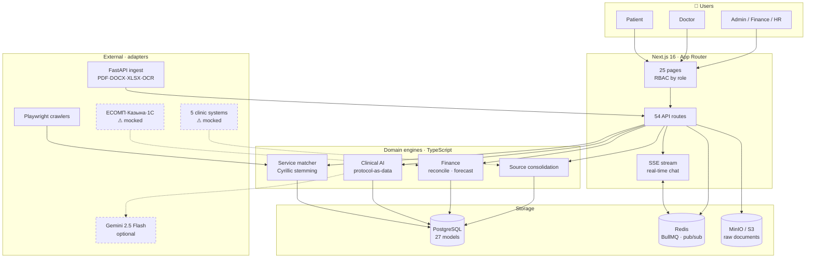

<div align="center">

# Daryger · Дәрігер

**One digital environment for a Kazakhstani polyclinic** — unified records across five
legacy systems, AI-assisted clinical triage, transparent medical pricing, and
automated financial control.

[](https://nextjs.org)
[](https://www.typescriptlang.org)
[](https://www.prisma.io)
[](https://www.postgresql.org)
[](https://fastapi.tiangolo.com)

</div>

---

## Why this exists

A polyclinic in Kazakhstan runs **five information systems at once** — КМИС Damumed,
ЕИСЗ МЗ РК, Aigýn, Qalqan and 1С. Every employee needs a separate account in each.
The same patient exists five times, and nothing reconciles them.

That fragmentation is not an inconvenience. It is a patient-safety problem:

> A doctor terminated in the HR system on 10 July 2026 is still marked **ACTIVE** in
> both clinical systems. Their login still opens patient records. Nobody is told.

Daryger was built to make that specific class of failure **visible and fixable**, and
to solve the nine adjacent problems that come from the same root cause.

<div align="center">

| The problem | What it costs | What Daryger does |
|---|---|---|
| 5 disconnected systems | Duplicate accounts, silent data drift | Consolidates with provenance, flags disagreement |
| Manual financial reconciliation | Weeks per quarter, human error | Automatic diff across ЕСОМП/Казына/1С |
| Late liver-disease detection | Cirrhosis instead of treatable disease | Protocol-driven risk scoring in triage |
| Opaque medical pricing | Patients overpay blindly | Aggregated, normalized, comparable prices |
| Specialist centres overloaded | Long waits for urgent cases | Doctor-to-doctor teleconsilium |

</div>

---

## Architecture



**Dashed borders mean mocked.** Daryger has no credentials for any government or
vendor system. Each adapter returns clearly-labelled sample data with the production
endpoint documented beside its environment variable. Swapping in a real integration is
a config change, not a rewrite. See [docs/INTEGRATIONS.md](docs/INTEGRATIONS.md).

### Design decisions worth knowing

| Decision | Why |
|---|---|
| **Records stored per source, never merged** | Merging destroys provenance. In healthcare, "which system said this?" *is* the feature. Disagreements surface for a human instead of being silently resolved. |
| **Rules engine, not ML, for clinical risk** | Auditable by a clinician, explainable factor by factor. Gemini narrates a score it never computes. |
| **Prisma is the only writer to Postgres** | The Python ingest service is stateless: file in, JSON out. Schema ownership stays in one place. |
| **SSE + Redis pub/sub, not polling** | Rural 3G is a target constraint. A 30 s DB re-sync self-heals a dropped event rather than freezing the chat. |
| **Archive, never overwrite** | Price history and audit trails survive re-imports. Required for 90-day retention. |

---

## What is built

<table>
<tr><th align="left">Track</th><th align="left">Capability</th><th align="center">Status</th></tr>

<tr><td rowspan="3"><b>Unified<br/>environment</b></td>
<td>Consolidation across 5 systems with conflict detection</td><td align="center">✅</td></tr>
<tr><td>Unified citizen-appeal inbox (iKomek · CRM · E-Өтініш) with SLA tracking</td><td align="center">✅</td></tr>
<tr><td>Screening invitation engine — cohort builder, SMS/app dispatch</td><td align="center">✅</td></tr>

<tr><td rowspan="4"><b>Finance &<br/>management</b></td>
<td>Automatic reconciliation ЕСОМП ↔ Казына ↔ 1С</td><td align="center">✅</td></tr>
<tr><td>Budget forecasting + allocation control (ФСМС / ГОБМП)</td><td align="center">✅</td></tr>
<tr><td>ОСМС/ГОБМП contract execution monitoring</td><td align="center">✅</td></tr>
<tr><td>HR process assistant — unclosed terminations, missing records</td><td align="center">✅</td></tr>

<tr><td rowspan="3"><b>Clinical AI</b></td>
<td>Hepatitis-B risk scoring, protocol encoded as data</td><td align="center">✅</td></tr>
<tr><td>Explainable "why this score" panel, offline fallback</td><td align="center">✅</td></tr>
<tr><td>Doctor-to-doctor teleconsilium</td><td align="center">✅</td></tr>

<tr><td rowspan="3"><b>Price<br/>transparency</b></td>
<td>Partner archive ingestion — PDF · DOCX · XLSX · scans</td><td align="center">✅</td></tr>
<tr><td>Catalogue normalization, 1 251 services</td><td align="center">🟡 63 %</td></tr>
<tr><td>Live public-site crawlers</td><td align="center">🟡 2 of 3</td></tr>
</table>

### Measured on live data

```
7 628  active price rows        370  services comparable across 2+ clinics
1 251  catalogue services         5  cross-system conflicts detected
   12  clinics, 2 cities          6  financial discrepancies · 124 000 000 ₸
```

---

## Quick start

```bash
docker compose up -d          # postgres · redis · minio · ingest
npm install
cp .env.example .env          # then set JWT_SECRET
npm run db:migrate && npm run db:seed
npm run dev
```

Open **http://localhost:3000**. The login page has a one-click role switcher.

| Role | Email | Password |
|---|---|---|
| Patient | `patient@daryger.kz` | `demo123` |
| Doctor | `doctor@daryger.kz` | `demo123` |
| Clinic admin | `ops@daryger.kz` | `demo123` |
| System admin | `admin@daryger.kz` | `demo123` |

> **No API keys required.** Without `GEMINI_API_KEY` triage uses a deterministic rules
> engine and clinical explanations render a templated factor list. Without
> `DAILY_API_KEY` video is skipped and text chat still works. Every AI path has a
> documented offline fallback.

### Seeding the demo scenarios

```bash
npx tsx scripts/seed-finance.ts        # contracts + budget allocations
curl -X POST localhost:3000/api/sources/sync    # consolidate the 5 systems
curl -X POST localhost:3000/api/finance/run     # import + reconcile + forecast
```

---

## Who benefits

### 👩‍🌾 Rural citizens and patients
* **No long journeys.** Patients in Shakhtinsk, Saran, Abay and other remote districts
  consult regional specialists without travelling 50–100 km to Karaganda.
* **Bilingual AI triage, 24/7.** Immediate urgency assessment in Kazakh or Russian.
* **Works on weak 3G.** Text-first consultations; video only when the doctor starts it.
* **Digital prescriptions on the phone**, without queueing for a paper copy.

### 👨‍⚕️ Doctors and regional hospitals
* **Prioritised queues.** Emergency and high-urgency patients surface first.
* **Pre-summarised symptoms** cut consultation preparation time.
* **Records keep themselves.** Prescriptions, clinical notes, and an audit trail of every
  state change.
* **A specialist opinion without a referral** — the teleconsilium keeps the patient with
  their own doctor.

### 🏛️ Akimat and regional health administration
* **Narrows the urban–rural access gap** in the Karaganda region.
* **Cross-system oversight.** Financial discrepancies, contract under-delivery and
  unfinished personnel procedures surface automatically instead of at quarter end.
* **Ready for integration.** Adapter-based architecture: connecting Damumed or ЕИСЗ is a
  configuration change, not a rewrite.

### 📣 Pitch and application materials

Akimat pitch in Kazakh and Russian, executive summary, and a printable trifold:

* [AKIMAT_PITCH_AND_PRESENTATION.md](AKIMAT_PITCH_AND_PRESENTATION.md)
* [BROCHURE_DESIGN_AND_TEXT.md](BROCHURE_DESIGN_AND_TEXT.md)
* [DARYGER_TRIFOLD_BROCHURE.html](DARYGER_TRIFOLD_BROCHURE.html)

Grant application package (Тәуелсіздік ұрпақтары, на русском):

* [docs/grant/ЗАЯВКА-ТУ.md](docs/grant/ЗАЯВКА-ТУ.md) — приложения 1, 2, 3
* [docs/grant/ЧЕКЛИСТ.md](docs/grant/ЧЕКЛИСТ.md) — соответствие Правилам

---

## Documentation

| Document | Contents |
|---|---|
| [docs/ARCHITECTURE.md](docs/ARCHITECTURE.md) | System design, data flow, why each decision was made |
| [docs/API.md](docs/API.md) | All 54 endpoints, auth, error format |
| [docs/DATA-MODEL.md](docs/DATA-MODEL.md) | 27 models, relationships, indexing strategy |
| [docs/INTEGRATIONS.md](docs/INTEGRATIONS.md) | Every mocked adapter and how to make it real |
| [docs/OPERATIONS.md](docs/OPERATIONS.md) | Running, testing, troubleshooting |
| [docs/plans/](docs/plans/) | Design records for major features |

---

## Testing

```bash
npm run test:unit          # 25 unit tests, no database required
npm run test:integration   # end-to-end against the test database
npm run test:phase1        # … phase4 — feature-level integration suites
```

---

## Tech stack

**Frontend** Next.js 16 (App Router) · React 19 · Tailwind CSS 4 · bilingual KZ/RU
**Backend** TypeScript · Prisma 7 · PostgreSQL 16 · Redis + BullMQ · MinIO/S3
**Parsing** FastAPI · Docling · pdfplumber · python-docx · openpyxl · Tesseract OCR
**AI** Gemini 2.5 Flash (optional, always with a deterministic fallback)
**Crawling** Playwright · robots.txt-aware, rate-limited

---

<div align="center">
<sub>Built for Kazakhstani healthcare · Astana &amp; Karaganda region</sub>
</div>
