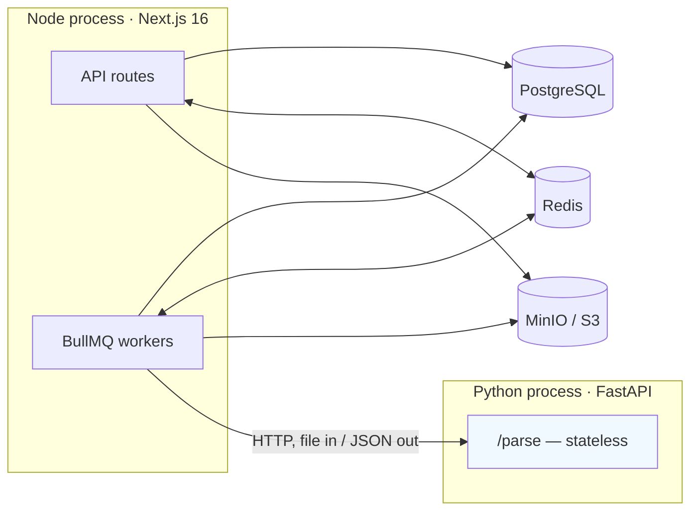
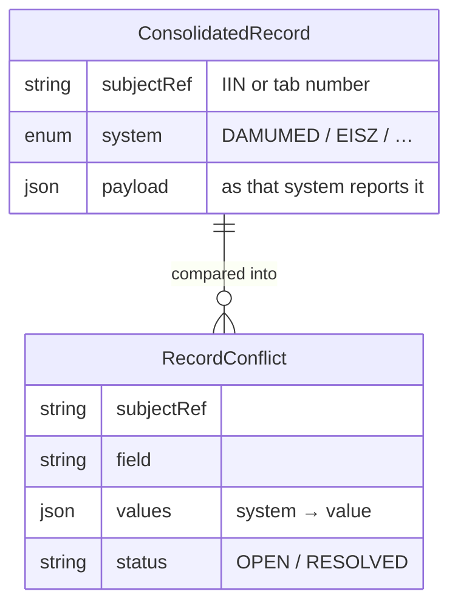
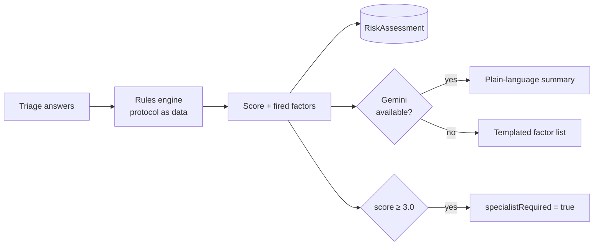
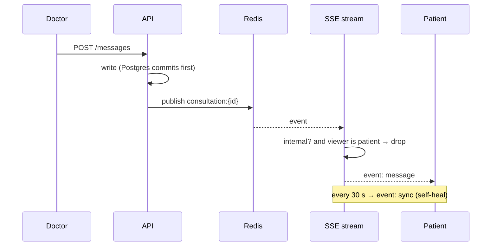
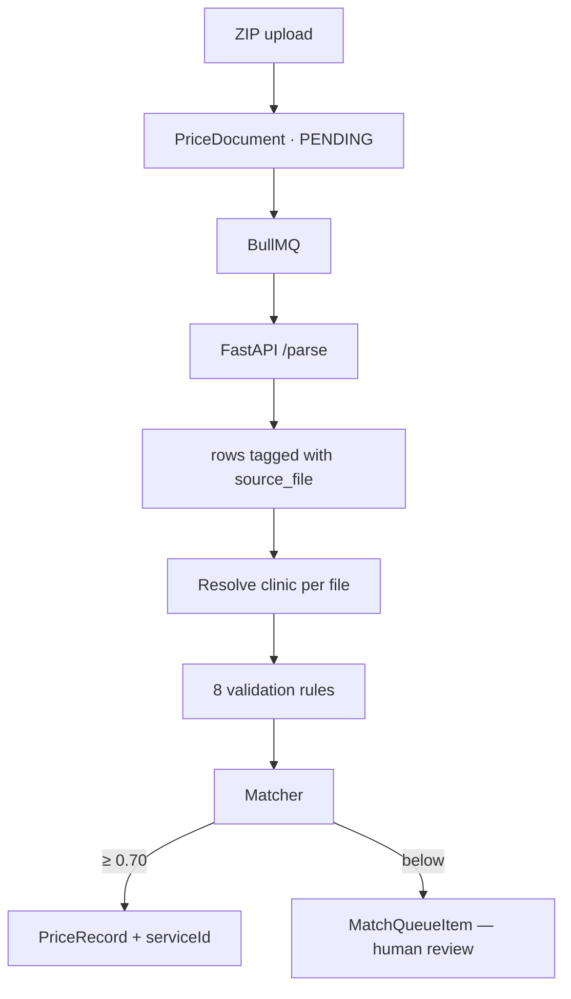
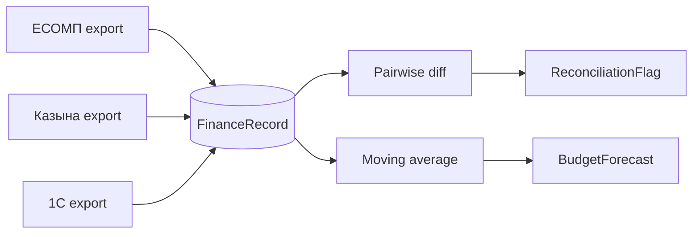

# Architecture

How Daryger is put together, and why each significant decision was made rather than
its alternatives.

---

## 1. The shape of the problem

Daryger addresses four problem families that share one root cause — **data that exists
in several places with no authority over which copy is right**:

1. **Clinical fragmentation.** Five systems (Damumed, ЕИСЗ, Aigýn, Qalqan, 1С), one
   account per employee per system, no reconciliation.
2. **Financial fragmentation.** ЕСОМП, Казына and 1С each hold part of the picture;
   quarterly reconciliation is manual.
3. **Clinical latency.** Liver disease is asymptomatic early; without automated
   screening it is found at cirrhosis.
4. **Price opacity.** Clinics publish prices in incompatible formats, or not at all.

Everything below follows from treating provenance as a first-class concern.

---

## 2. Runtime topology



Three processes, one database.

**Only Prisma writes to Postgres.** The Python service receives a file and returns
structured rows; it holds no connection string and owns no schema. This was a
deliberate constraint — an earlier iteration had a second backend with its own
SQLAlchemy models against the same database, which meant two sources of schema truth
and no way to reason about migrations. That service was removed.

### Why a separate parser process at all

Document parsing needs Docling, PyMuPDF, Tesseract and their system libraries. Keeping
that dependency tree out of the web process means the app image stays small and a
segfault in a native OCR library cannot take down the API. The cost is one network hop
per document, which is irrelevant against a 10-second parse.

---

## 3. Consolidation model

The core design question: when Damumed says a patient's phone is `+7 701 555 0123` and
ЕИСЗ says `+7 701 200 7788`, what does the database hold?

**Three options were considered.**

| Approach | Trade-off |
|---|---|
| **Read-through federation** — query all five live per request | No staleness, no sync job. But one unreachable source breaks the page, every view costs five network calls, and nothing is auditable afterwards. These are fragmented government systems; unavailability is the normal case. |
| **Full ETL into the primary models** | Simplest to read. But it destroys provenance — you cannot answer "which system said this?" — and a faulty sync corrupts clinical records irreversibly. |
| **Consolidation with provenance** ← chosen | Each system's claim stored separately; disagreements raised as conflicts for a human. Costs a sync job and one poll of staleness. |



Resolution records the operator's decision on the conflict; it does **not** write back
over the source records. Each system's copy stays as that system reported it, so the
audit trail survives and a later sync cannot silently undo a human judgement.

Only fields in `RECONCILED_FIELDS` are compared. Comparing every key would flood the
queue with expected differences — each system keeps its own ids and timestamps — and a
queue full of noise gets ignored.

---

## 4. Clinical AI



**Version 1 is a transparent rules engine, not a model.** The hepatitis-B protocol is
encoded as an array of `{ factor, test, weight }` — data, not an `if/else` chain. That
makes it auditable by a clinician, extensible to other conditions by configuration, and
replaceable by an ML scorer behind the same interface later.

**Gemini never touches the score.** It receives the already-computed factors and is
asked only to narrate them. If it is unavailable the panel renders the raw factor list,
mirroring the fallback triage already had. An AI that invents a clinical number is
worse than no AI.

---

## 5. Real-time chat

Consultation chat previously polled the full consultation every 5 seconds — up to 5 s
of latency and constant bandwidth on an idle chat, against a product that targets rural
3G.



Two safety properties fall out of this design:

- **A dropped publish costs latency, not data.** The 30-second re-sync degrades the
  worst case to the old polling behaviour rather than a silently frozen chat.
- **Doctor-to-doctor messages are filtered at the stream, not at publish.** One channel
  serves both audiences, and there is exactly one place to get the rule right. It is
  enforced in four places: the stream, both thread reads, and the list preview.

Accepted cost: one Redis subscriber connection per open chat (ioredis blocks a
connection in subscriber mode). At pilot scale that is tens of connections against a
10 000 default limit; revisit with a multiplexing subscriber in the thousands.

---

## 6. Price ingestion



**One archive holds one price list per clinic.** Rows carry the file they came from so
each is attributed to its own clinic. Without that, every clinic's prices collapsed
under whichever clinic the database returned first — and cross-clinic comparison, the
entire product premise, had nothing to compare.

**Deduplication keys on the raw service name, never on the matched `serviceId`.** A
clinic legitimately sells several distinct services that normalize to one catalogue
entry ("Глюкоза натощак" and "Глюкоза с нагрузкой" both match "Глюкоза"). Keying on
`serviceId` made each destroy the previous — 59 % of a real import vanished silently
inside one run.

### The matcher

Exact match → synonym → bidirectional stemmed token overlap → Levenshtein, first hit
wins above the confidence threshold. Cyrillic-specific work carries most of the weight:
OCR homoglyph normalization (`ajit` → `алт`), a two-tier stop-word taxonomy, and prefix
stemming so `кардиолог` / `кардиологу` / `кардиологом` collapse to one token.

> **Known limitation.** Prefix stemming at 5 characters collides `магния` (magnesium, a
> lab test) with `магнитотерапия` (magnetotherapy, a procedure). A proper Russian
> stemmer is the fix; raising the prefix length regresses the morphology handling that
> took normalization from 1 % to 63 %.

---

## 7. Finance



Matching is by shared document id where systems have one, otherwise by
`category + period` within a tolerance. **Records unique to one system are reported,
not ignored** — a payment one system never saw is the costlier error.

Two honesty constraints are built into the numbers:

- A forecast built from fewer than three periods is labelled
  `insufficient_history`, and the UI says so. A "forecast" from one quarter is that
  quarter copied forward, and a reader deserves to know.
- Contract projections are suppressed below 25 % elapsed. Straight-line extrapolation
  from a few days swings wildly — one busy week reads as 300 % over-delivery.

Utilisation uses `max(committed, spent)`, not their sum: money is committed first and
spent out of that commitment, so adding them double-counts every tenge.

---

## 8. Security posture

| Control | Implementation |
|---|---|
| Session auth | JWT in an httpOnly cookie. **No fallback secret** — the app refuses to boot without `JWT_SECRET`. |
| Authorization | 7-role enum, checked per route. Participation checks on every consultation read *and* write. |
| Concurrency | Conditional `updateMany` for consultation claims, slot booking and teleconsilium claims — the database arbitrates, losers get 409. |
| Audit | `logAction()` on every state change: prescriptions, bookings, conflict resolution, syncs. |
| Outbound calls | Every `fetch` goes through `fetchWithTimeout`; no request can hang a worker indefinitely. |
| Crawling | robots.txt checked before every fetch, enforced delay between requests. |

---

## 9. Directory map

```
src/
  app/
    api/            54 route handlers
    admin/          operator UIs — sources · finance · appeals · verification
    doctor/         queue · consultation · teleconsilium · schedule
    patient/        triage · consultation · appointments
    price/          search · compare
  lib/
    adapters/       appeals/ · sources/ · finance/   ← all mocked, documented
    catalog/        matcher · ingest · clinic-resolver
    clinical-ai/    protocols/ · risk-model · explain
    crawler/        adapter · rate-limit · sources/
    finance/        reconcile · forecast · contracts
    hr/             anomaly-rules
    sources/        sync · analytics
    realtime.ts     Redis pub/sub
    http.ts         fetchWithTimeout
services/ingest/    FastAPI — parsers/ pdf · docx · xlsx · ocr · docling
prisma/             schema · 10 migrations · seed data
docs/               this documentation
```
