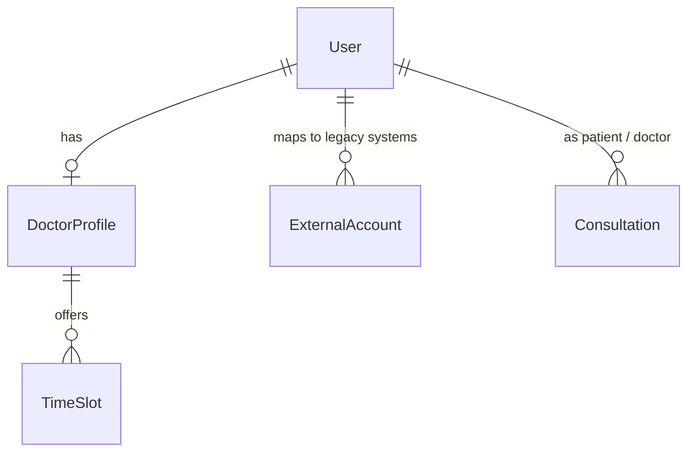
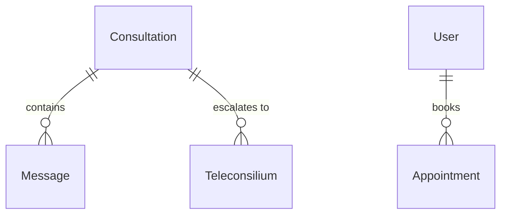
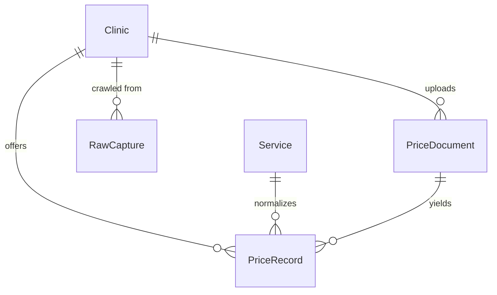
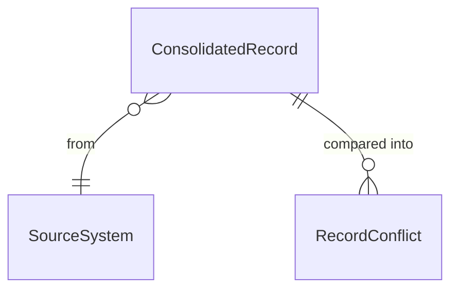
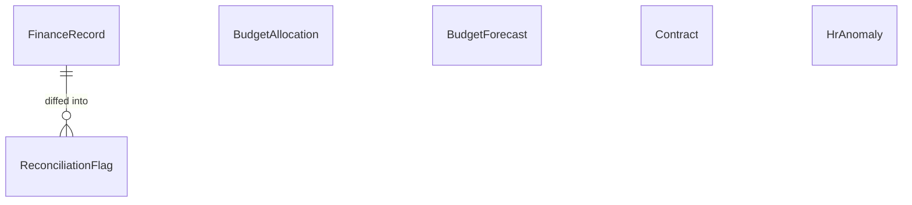

# Data model

27 Prisma models over PostgreSQL, in five domains. Prisma is the only writer.

---

## Identity & access



`Role` is an enum, not a boolean pair: `PATIENT`, `DOCTOR`, `CLINIC_ADMIN`,
`PARTNER_OPERATOR`, `FINANCE_ANALYST`, `HR_ANALYST`, `SYSTEM_ADMIN`.

`ExternalAccount` is the answer to "one employee, five logins" — a Daryger user linked
to their account in each legacy system.

---

## Care



| Model | Notes |
|---|---|
| `Consultation` | `status`, `urgency` (4 tiers), `specialistRequired`, `referredToId` |
| `Message` | `isInternal` marks doctor-to-doctor content, hidden from patients |
| `Teleconsilium` | GP asks, specialist claims and answers — patient stays with the GP |
| `Appointment` · `TimeSlot` | Booking claims a slot conditionally inside a transaction |

---

## Clinical AI

`RiskAssessment` stores `score`, `modelVersion`, and `flags` — the protocol factors
that fired. Keeping the factors, not just the number, is what makes the "why this
score" panel possible and the result auditable.

---

## Price



| Model | Purpose |
|---|---|
| `Service` | Catalogue: name, `synonyms[]`, category, ICD code |
| `Clinic` | Public or partner; BIN, contacts, city, geo |
| `PriceRecord` | Resident/non-resident prices, original currency, `isVerified`, `sourceType` |
| `PriceDocument` | Uploaded file, parse status and log, S3 key |
| `MatchQueueItem` | Below-threshold matches awaiting human review |
| `RawCapture` | Crawl payload pointer + provenance |

**`sourceType` distinguishes `CRAWL`, `CRAWL_FALLBACK` and `PARTNER_DOC`.** The middle
value exists because a crawler that silently returns sample data when a site is
unreachable is indistinguishable from one that scraped — the fallback rows are
representative, not real, and the database has to say so.

**Rows are archived (`isActive = false`), never deleted.** Price history survives
re-imports, and raw retention requirements are met.

---

## Unified information system



`SourceSystem` — `DAMUMED`, `EISZ`, `AIGYN`, `QALQAN`, `ONEC`.

`ConsolidatedRecord` is unique on `(system, externalId)`; the `subjectRef` (IIN for a
person, tab number for staff) is what lets two systems' versions of the same subject be
compared **without merging them**.

`RecordConflict` is unique on `(subjectRef, field, status)` so re-running the sync
refreshes an open conflict rather than duplicating it, and anything already resolved
stays resolved.

---

## Finance & HR



| Model | Purpose |
|---|---|
| `FinanceRecord` | One figure as one system reported it. Unique `(source, externalId)` |
| `ReconciliationFlag` | `MISSING_IN_B` or `AMOUNT_MISMATCH`, with both amounts |
| `BudgetForecast` | Projection per `(period, category)`; `method` records how it was derived |
| `BudgetAllocation` | Allocated / committed / spent per programme and category |
| `Contract` | ОСМС/ГОБМП planned vs delivered volume and amount |
| `HrAnomaly` | Unique `(employeeRef, type, status)` so scans refresh rather than duplicate |

`FinanceSource` — `ESOMP`, `KAZYNA`, `ONEC_FIN`, `GOSZAKUP`, `FSMS`.

---

## Ops

| Model | Purpose |
|---|---|
| `Appeal` | Citizen appeal from iKomek / CRM / E-Өтініш, with SLA deadline |
| `ScreeningProgram` | Criteria as JSON — age, city, last-screened-before |
| `ScreeningInvite` | `QUEUED → SENT → DELIVERED → RESPONDED → COMPLETED` |
| `AuditLog` | Actor, action, entity, metadata — written on every state change |

---

## Indexing strategy

Every foreign key is indexed, plus composites matching real query shapes. Measured
effect on the ingest dedup lookup against 9 474 rows:

```
before   Seq Scan    1.718 ms
after    Index Scan  0.071 ms      ← runs once per imported row
```

Composites worth noting:

| Index | Why |
|---|---|
| `Message(consultationId, createdAt)` | Chat pages one consultation in time order |
| `MatchQueueItem(rawName, status)` | Hottest lookup in a bulk import — once per unmatched row |
| `PriceRecord(clinicId, serviceNameRaw, isActive, parsedAt)` | Dedup before every insert |
| `Appeal(status, slaDueAt)` | Inbox sort and the overdue sweep |
| `Consultation(status, specialistRequired)` | Doctor dashboard counts and specialist queue |
| `RiskAssessment(patientId, computedAt)` | History, newest first |

---

## Migrations

10 migrations under `prisma/migrations/`. Applied with:

```bash
npm run db:migrate      # development
npx prisma migrate deploy   # production
```
